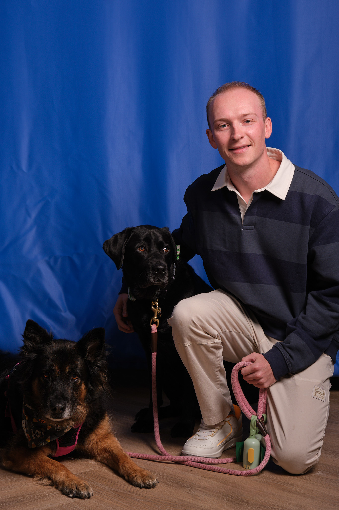

# Nash Whitacre

## Bio
Hello! I'm Nash Whitacre, an analytically-minded data guru who excels at learning new things, leading and collaborating with others, having a good time, and being the best I can be. I place a heavy emphasis on planning and strategy to make sure that no time is wasted and that there is no confusion amongst team members. My philosophy is that people shouldn't have to do anything which they don't want to do, so I try to understand the needs and desires of others then work on their behalf to make products, tasks, and processes as enjoyable as possible.

Hands-on experience is how I learn best, so I have created this portfolio to learn more about development while showcasing what I have done in my career.

Some fun facts about me are that I love animals, I have been deemed a cat AND dog whisperer, and I am very good at billiards. I love the Baltimore Ravens, Arsenal Football Club, and the Miami Hurricanes.

Please look through my portfolio below and feel free to contact me at nashwhitacre@gmail.com or find me on LinkedIn!

## Career History

  
<strong>Chewy</strong>

  

    After I completed my masters I accepted a full time position with Chewy working as a Business Analyst in Product Analytics.
  

  
<strong>University of Miami (Masters)</strong>

  

    During my Senior year of undergrad I began an accelerated Masters program where I took graduate courses in Business Analytics while completing my Bachelors. This program involved more advanced data science courses, along with electives in data visualizations, GIS, and linear algebra.

    I completed the Masters in one semester following graduation from undergrad. That semester was done remotely as the campus was still closed down for Covid (fall of 2020). During this time I also completed a second internship with Chewy and another internship with the University of Miami Athletic department. 
  

  
<strong>University of Miami (Undergrad)</strong>

  

    I attended the University of Miami for college, majoring in Business Analytics with a minor in Sports Administration. I graduated Summa Cum Laude and completed a few internships during my time in Miami including the Miami Dolphins, the Miami Super Bowl Host Committee, and Chewy.

    Some of my favorite courses were a C++ programming class where I first learned to program, data science classes where I learned different machine learning models and their applications, and match courses in calculus, stochastic modeling, and optimization.

    My main club during undergrad was UPUP, a service dog training club where I learned how to train dogs and raised my own puppy for the Canine Companions non-profit organization. I was the Lead Trainer for UPUP and taugh over 20 trainers how to properly work with and raise puppies for service.
  

  
<strong>Highschool</strong>

  

    I attended Annapolis High School from 2012-2016, graduating in the top 5% of my class and earning my IB Diploma from the International Baccalureatte program. I played on the Baseball, Soccer, Tennis, and Unified Bowling teams.

    In the IB program you select 2 subjects to take as Higher Level (HL) courses. I completed HL Math, completing an individual project to explore the buoyancy of boats based on numerical integration to calculate the volume of their hulls. I also completed HL Spanish, earning college credits toward a cohort for graduation.

    I was able to visit Denmark as part of an IB exchange program, I visited Czechia twice as part of a church partnership to teach children English, and I visited Chile and Argentina on a trip to see my brother who was studying abroad at the time.
  

